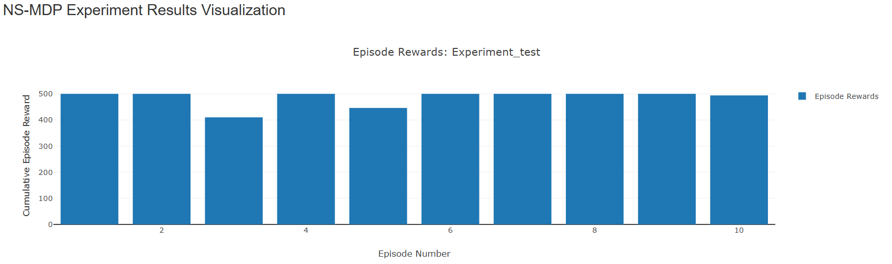

## Modeling Non-Stationary Markov Decision Processes in WebGME
A Non-Stationary Markov Decision Process (NS-MDP) is a variation of the traditional Markov Decision Process (MDP) where the transition dynamics and/or reward functions change over time. Unlike stationary MDPs, where these components remain fixed, NS-MDPs model environments that evolve, making them suitable for real-world scenarios such as adaptive systems, dynamic markets, or changing user behaviors.
To learn more, refer to the [slide-deck.](https://docs.google.com/presentation/d/1qu-CmwJ1tXWzr5nFbXwRBkPdV58_IwHGPZhmyvXYNQA/edit?usp=sharing)

In this project we do the following:
- Design a generic model to describe the decision making process between an agent and non-stationary environment.
- Let users design an experiment to evaluate agent performance on an instance of a NS-MDP. 
- Integrate the WebGME model with an external Python Package for simulation.
- Provide a (work in progress) visualizer to examine experiment results

The project uses [Gymnasium](https://gymnasium.farama.org/) Toy environments. 

# NS-MDP Webgme implementation
## Installation
First, install the p2 following:
- [NodeJS](https://nodejs.org/en/) (LTS recommended)
- [MongoDB](https://www.mongodb.com/)
- [Docker](https://www.docker.com/)


## Docker instructions: 
```(bash)
# Clone the repository:
git clone https://github.com/nkepling/ns_mdp_lang
cd ns_mdp_lang

# We are running mongo in a separate container. To run mongo:
docker pull mongo
docker run -d -v ~/dockershare/db:/data/db --name mongo mongo

# Build and run the Docker container:
docker build -t webgme .
docker run -d -p 8888:8888 -v ~/dockershare:/dockershare --link mongo:mongo --name=webgme webgme
```

Finally, navigate to http://localhost:8888 . 
Create a new project and import nsmdp.webgmex to start using the project!

## Steps to run an Experiment in WebGME
1. Under ROOT, make an experiment object.
2. In the Experiment, Select an Agent(MCTS or RL) and an NS-Gym Env.
3. Change the hyperparameters (attributes) of the agent.
4. Go inside the NS-Gym Env and create a wrapper (NSClassicControlWrapper or NSClassicControlWrapper). Edit the attributes of the wrapper specific to your experiment.
5. Inside the Wapper select the Gym environment you want to use like Frozen Lake or CartPole. You can also change the parameters of the environment.
6. Add an Update function and select tunable paprameters like length.
7. Inside the update function select the Scheduler and edit the attributes.
8. Now go inside the experiment and run the ExperimentCodeGenerator plugin.
9. This will create the code, that you can see as the "code" attribute.
10. Run the next plugin, RunExperimentCode. This will run the experiment- this will take some time.
11. The result of the experiment can be seen the ResultsViz and the trace file is also saved as exp_result attribute.

Feel free to use Experiment_test_2 as a reference to model your experiment.
The result should look like this:

